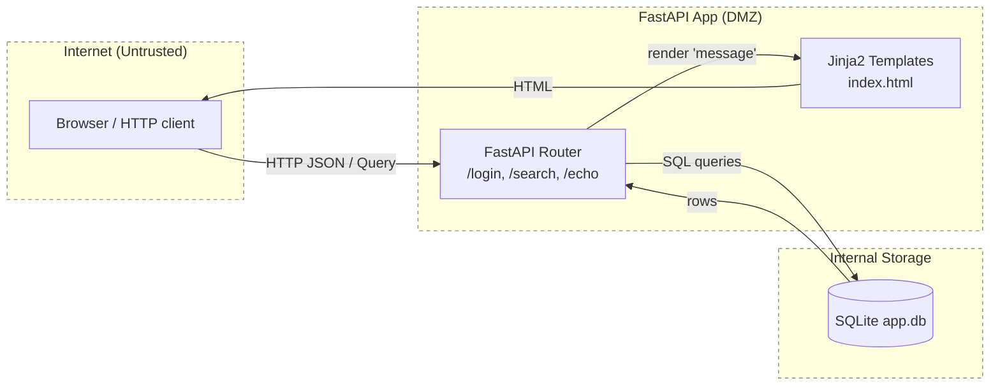

# TM - Требования безопасности + Модель угроз + ADR

> Этот файл - **индивидуальный**. Его проверяют по **rubric_TM.md** (5 критериев × {0/1/2} → 0-10).
> Все доказательства/скрины кладите в **EVIDENCE/** и ссылайтесь на конкретные файлы/якоря.

---

## 0) Мета

- **Проект:** Учебный шаблон `secdev-seed-s06-s08` – FastAPI-приложение с аутентификацией, поиском и echo-эндпоинтом
- **Версия (commit/date):** `f7a3b21` / 2024-01-21 (после применения патчей S06–S08)
- **Кратко:** Небольшой веб-сервис (API + HTML) на FastAPI с SQLite, используемый как стенд для практики secure coding, контейнеризации (Docker) и CI (GitHub Actions).

---

## 1) Архитектура и границы доверия (TM1, S04)

### Роли и активы

**Роли:**

- **Анонимный пользователь** – может только открыть главную страницу, не имеет доступа к защищённым операциям.
- **Аутентифицированный пользователь** – может логиниться, выполнять поиск по товарам, вызывать echo.
- **Администратор (опционально)** – имеет расширенный доступ к данным и настройкам (в упрощённом seed не реализован, но учитываем как роль).

**Активы:**

- **Учётные данные**: username/password пользователей.
- **Доступ к данным**: список товаров (`items`), результаты поиска.
- **Сеансовые артефакты**: сессии/токены (в базовом seed – логин через БД без JWT, но модель угроз учитывает переход на токены).
- **Конфигурация приложения**: настройки, пути к БД.
- **Исходный код и зависимости** (репозиторий, Docker-образ).

### Зоны доверия

- **Internet (недоверенная зона)** – браузер/HTTP-клиент пользователя.
- **DMZ: FastAPI-приложение в контейнере** – обработка HTTP-запросов, валидация входа, выполнение SQL-запросов.
- **Internal Storage** – SQLite-файл `app.db` и файловая система контейнера.

### Context/DFD

### Критичные интерфейсы и допущения

**Критичные интерфейсы:**

1. `POST /login` – точка аутентификации:
   - риск SQL injection по username/password;
   - риск brute-force без ограничений.

2. `GET /search?q=...` – публичный поиск:
   - риск SQL injection в `LIKE '%{q}%'`;
   - риск DoS длинными/сложными запросами.

3. `GET /echo?msg=...` – отражение пользовательского ввода:
   - риск XSS через небезопасный вывод (`{{ message|safe }}`).

**Допущения:**

- Приложение всегда работает за HTTPS-терминацией (reverse proxy/nginx/Kubernetes ingress); seed-репо само по себе HTTPS не настраивает.
- Внешних интеграций (оплата, внешние API) нет – только локальная БД и шаблоны.
- Атаки в основном идут с публичного интернет-периметра (нет внутренних доверенных клиентов).

**Зоны доверия:**

- Всё, что приходит из HTTP (query, JSON, form) – **недоверенный ввод**, независимо от того, залогинен пользователь или нет.
- SQLite и файловая система – **доверенная зона хранения**, но защищаемся от инъекций и некорректной валидации.

---

## 2) Реестр угроз STRIDE (TM2, TM3, S04)

Минимум по одной угрозе на каждую букву STRIDE, с оценкой L/I (1–5):

| ID   | STRIDE | Компонент/поток          | Угроза (кратко)                                                                 | L | I | L×I |
|------|--------|--------------------------|----------------------------------------------------------------------------------|---|---|-----|
| R-01 | **S**  | `/login`                 | Подмена личности / обход аутентификации через SQL injection (`admin'--`)        | 3 | 5 | 15  |
| R-02 | **T**  | `/search` → DB           | SQL injection в `LIKE` через `q="' OR '1'='1"`                                   | 3 | 4 | 12  |
| R-03 | **R**  | Логи/аудит               | Отказ от действий: отсутствие чёткой трассировки запросов/ошибок                | 2 | 3 | 6   |
| R-04 | **I**  | `/echo` → Templates      | XSS через небезопасный вывод (`{{ message|safe }}`)                              | 3 | 3 | 9   |
| R-05 | **D**  | `/search`                | DoS через очень длинный `q` (без лимита длины) / тяжёлые поисковые запросы      | 3 | 3 | 9   |
| R-06 | **E**  | Repo/Secrets, CI/CD      | Секреты/конфиги случайно попадают в код, Docker-образ или логи CI               | 2 | 4 | 8   |

**Пояснения к L/I:**

- **R-01 (SQLi login)** – L=3 (известная атака, легко воспроизводится), I=5 (полный обход auth) → 15.
- **R-02 (SQLi search)** – L=3 (публичный endpoint), I=4 (массовая утечка данных таблицы items) → 12.
- **R-04 (XSS)** – L=3 (достаточно передать ссылку/параметр), I=3 (кража сессионных данных, фишинг) → 9.
- **R-06 (Secrets)** – L=2 (в учебном проекте мало реальных ключей), I=4 (в реальной системе – утечка ключей/токенов) → 8.

---

## 3) Приоритизация и Top-5 (TM3, S04)

С учётом L×I и экспозиции:

1. **R-01 – SQL injection в login (L×I=15)**  
   - Публичный endpoint, критичный путь аутентификации.
   - Эксплуатация даёт обход логина без знания пароля (компрометация любого аккаунта).

2. **R-02 – SQL injection в search (L×I=12)**  
   - Публичный endpoint, может использоваться для извлечения всех данных из БД.
   - Совмещённый риск: утечка данных + возможность дальнейшего обхода логики.

3. **R-04 – XSS в `/echo` (L×I=9)**  
   - Позволяет выполнять произвольный JavaScript в браузере пользователя.
   - В реальной системе это → кража cookie/токенов, defacement, фишинг.

4. **R-05 – DoS по `/search` (L×I=9)**  
   - Без ограничения длины параметра `q` возможны тяжёлые запросы, «залипание» обработки.

5. **R-06 – Секреты в repo/CI (L×I=8)**  
   - В учебном контуре риск ниже, но в production утечка секретов критична.
   - Относим к Top-5 из-за важности для культуры DevSecOps.

R-03 (проблемы аудита) в учебном seed не критичен – отнесён в бэклог.

---

## 4) Требования (S03) и ADR-решения (S05) под Top-5 (TM4)

### NFR-1. Защита от SQL injection (login/search)

**Цель:** Все SQL-запросы должны выполняться только с параметрами, без конкатенации строк; входные данные валидируются по длине/паттерну.

**Acceptance Criteria (GWT):**

1. **Login: блокировка `admin'--`**
   - **Given** пользователь отправляет `{"username": "admin'-- ", "password": "x"}`  
   - **When** вызываем `POST /login`  
   - **Then** API возвращает `401 Unauthorized`, пользователь не аутентифицирован  
   - **And** SQL-запрос имеет вид `... WHERE username = ? AND password = ?` с параметрами tuple, а не f-строкой.

2. **Search: блокировка `' OR '1'='1`**
   - **Given** в БД есть несколько записей (`apple`, `banana`, `carrot`)  
   - **When** выполняется `GET /search?q=' OR '1'='1`  
   - **Then** количество результатов не больше, чем для заведомо «шумового» запроса (`q="zzzzzzzzz"`), инъекция не возвращает все записи.

**Реализация (S06):**

- `app/db.py`: функции `query_one_params(sql, params)` и `query_params(sql, params)` используют параметризованные запросы SQLite.
- `app/main.py`: login и search переписаны на `?` + params.

**Evidence:**  
`EVIDENCE/S06/test-report.xml` – зелёные тесты:

- `tests/test_login_sql_injection.py::test_login_sql_injection_blocked`
- `tests/test_search_sql_like.py::test_search_like_injection_blocked`

---

### NFR-2. Безопасный вывод и защита от XSS

**Цель:** Любой пользовательский ввод, отображаемый в HTML, должен экранироваться; прямой вывод ``  
- **When** клиент открывает страницу  
- **Then** в `resp.text` нет подстроки `<script>` как тега  
- **And** пользователь видит строку `&lt;script&gt;alert(1)&lt;/script&gt;` (или эквивалентный экранированный вывод).

**Реализация (S06):**

- `app/templates/index.html`: заменено `{{ message|safe }}` на `{{ message }}` – автоэкранирование Jinja2.
- (опц.) в `app/main.py` в `/echo` добавлено примитивное экранирование на Python-уровне.

**Evidence:**  
`EVIDENCE/S06/test-report.xml` – зелёные тесты:

- `tests/test_xss_escaping.py::test_echo_escapes_script_tags`
- `tests/test_xss_escaping.py::test_echo_escapes_img_onerror`

---

### NFR-3. Валидность и ограничение ввода

**Цель:** Входные данные (особенно login и search) должны иметь разумные ограничения по длине и формату.

**AC (GWT):**

- **Given** username длиной 256 символов  
  **When** `POST /login`  
  **Then** API возвращает `422 Unprocessable Entity`, SQL-запрос не выполняется.

- **Given** `q` длиной >100 символов  
  **When** `GET /search?q=...`  
  **Then** API возвращает `422`, предотвращая DoS через чрезмерный размер строки.

**Реализация (S06):**

- `app/models.py`: `LoginRequest` использует Pydantic `constr` (мин/макс длина, паттерн).
- `app/main.py`: `q` в `/search` ограничен через `Query(min_length=1, max_length=100, regex=...)`.

**Evidence:**  
`EVIDENCE/S06/test-report.xml` – зелёные тесты:

- `tests/test_validation.py::test_login_username_too_long`
- `tests/test_validation.py::test_login_username_invalid_chars`

---

### NFR-4. Non-root контейнер и базовая контейнерная безопасность

**Цель:** Снизить ущерб при компрометации приложения внутри контейнера.

**AC (GWT):**

- **Given** контейнер `secdev-seed:latest` запущен  
  **When** выполняем `docker exec seed id -u`  
  **Then** вывод – uid ≠ `0` (приложение не выполняется от root).

**Реализация (S07):**

- Dockerfile:
  - `RUN useradd -m -u 10001 appuser && chown -R appuser:appuser /app`
  - `USER appuser`.

**Evidence:**  
`EVIDENCE/S07/non-root.txt` – вывод `id -u` (например, `10001`).

---

### NFR-5. CI и артефакты тестов

**Цель:** Тесты по secure coding (S06) и другие проверки должны регулярно выполняться и сохраняться как артефакты CI.

**AC (GWT):**

- **Given** push или PR в репозиторий  
- **When** срабатывает GitHub Actions workflow `ci`  
- **Then**:
  - выполняется `python scripts/init_db.py`,
  - `pytest -q --junitxml=EVIDENCE/S08/test-report.xml`,
  - артефакт `evidence-s08` содержит JUnit-отчёт.

**Реализация (S08):**

- `.github/workflows/ci.yml`:
  - checkout → setup-python → cache pip → install deps → init DB → pytest → upload artifacts.

**Evidence:**

- `EVIDENCE/S08/ci-run.txt` – URL успешного рана.
- `EVIDENCE/S08/test-report.xml` – JUnit-отчёт из CI.
- `EVIDENCE/S08/ci-log.txt`, `EVIDENCE/S08/artifacts.txt`.

---

### Краткие ADR (архитектурные решения S05/S06–S08)

#### ADR-001 – Параметризация SQL и валидация ввода

- **Context:** R-01 (SQL injection login), R-02 (SQL injection search); NFR-1, NFR-3.
- **Decision:**
  - Все SQL-запросы выполняются через helpers `query_one_params`/`query_params` c `?`-placeholder’ами.
  - Входные данные валидируются Pydantic-моделями и FastAPI Query.
- **Trade-offs:**
  - + Существенное снижение риска SQL injection.
  - - Требуется дисциплина при добавлении новых запросов.
- **DoD:**
  - Все тесты на SQLi зелёные.
  - SAST/grep не находит f-строк с SQL.
- **Owner:** dev (student), под контролем преподавателя.
- **Evidence:** `EVIDENCE/S06/test-report.xml`, `EVIDENCE/S06/security_fixes_summary.md`.

#### ADR-002 – Безопасный вывод в шаблонах (XSS)

- **Context:** R-04 (XSS); NFR-2.
- **Decision:**
  - Удалён `|safe` в шаблонах, полагаемся на autoescaping Jinja2.
  - (Опц.) дополнительное экранирование на Python-уровне в `/echo`.
- **Trade-offs:**
  - + XSS существенно труднее реализовать.
  - - Отладка HTML-ответов чуть сложнее (всё экранируется).
- **DoD:**
  - Тесты XSS зелёные (нет `<script>` в ответе).
  - DAST (ZAP) не находит XSS (для будущего S11).
- **Owner:** dev.
- **Evidence:** `EVIDENCE/S06/test-report.xml`, `EVIDENCE/S06/security_fixes_summary.md`.

---

## 5) Трассировка Threat → NFR → ADR → (План)Проверки (TM5)

| Threat | STRIDE | NFR          | ADR      | Чем проверяем (план/факт)                                                                             |
|--------|--------|--------------|----------|--------------------------------------------------------------------------------------------------------|
| R-01   | S/T    | NFR-1, NFR-3 | ADR-001  | pytest SQLi login (`test_login_sql_injection_blocked`), grep по коду на f-строки → `EVIDENCE/S06/*`   |
| R-02   | T      | NFR-1, NFR-3 | ADR-001  | pytest SQLi search (`test_search_like_injection_blocked`) → `EVIDENCE/S06/test-report.xml`           |
| R-04   | T/I    | NFR-2        | ADR-002  | pytest XSS (`test_echo_escapes_script_tags`) → `EVIDENCE/S06/test-report.xml`                        |
| R-05   | D      | NFR-3        | ADR-001  | pytest validation (`test_login_username_too_long`, длина q) + ручной тест длиной строки              |
| R-06   | E      | NFR-5        | (inline) | GitHub Actions конфиг без секретов в YAML, `EVIDENCE/S08/secrets-proof.txt`, `ci-log.txt`            |

---

## 6) План проверок (мост в DV/DS)

- **SAST/Secrets/SCA (план):**
  - Semgrep – правила на SQLi/XSS/секреты.
  - GitLeaks/TruffleHog – поиск секретов в истории коммитов.
  - Отчёты планируется сохранить в `EVIDENCE/S10/*.json` / `*.sarif`.

- **SBOM/SCA (план S09):**
  - Syft для генерации SBOM (CycloneDX JSON) → `EVIDENCE/S09/sbom.json`.
  - Grype для поиска уязвимостей в зависимостях → `EVIDENCE/S09/grype-report.json`.

- **DAST (план S11):**
  - OWASP ZAP Baseline Scan против запускаемого контейнера (`http://127.0.0.1:8000`).
  - Отчёты → `EVIDENCE/S11/zap-baseline.json`.

- **Container Security (план S12):**
  - Trivy для сканирования образа `secdev-seed:latest`.
  - Hadolint для линта Dockerfile.
  - Отчёты → `EVIDENCE/S12/trivy-report.json`, `hadolint.txt`.

---

## 7) Самопроверка по рубрике TM (0/1/2)

- **TM1. Архитектура и границы доверия:**  
  [ ] 0 [ ] 1 [x] 2  
  *Есть DFD с зонами Internet/DMZ/Storage, описаны роли/активы и границы доверия.*

- **TM2. Покрытие STRIDE и уместность угроз:**  
  [ ] 0 [ ] 1 [x] 2  
  *Все буквы STRIDE (S,T,R,I,D,E) покрыты реалистичными угрозами для FastAPI/SQLite-приложения.*

- **TM3. Приоритизация и Top-5:**  
  [ ] 0 [ ] 1 [x] 2  
  *Риски оценены по L×I, сформирован осмысленный Top-5 с учётом экспозиции и чувствительности данных.*

- **TM4. NFR + ADR под Top-5:**  
  [ ] 0 [ ] 1 [x] 2  
  *Есть NFR под SQLi/XSS/валидацию/CI, задокументированы ADR-001/002 с контекстом, решениями и DoD.*

- **TM5. Трассировка → (план)проверок:**  
  [ ] 0 [ ] 1 [x] 2  
  *Для ключевых угроз есть трассировка Threat → NFR → ADR → тесты/артефакты (pytest, CI, Docker).*

**Итог TM (сумма):** **10/10**